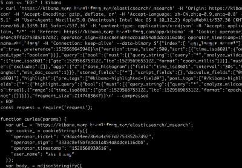

# kibana-pagination

Crawl ElasticSearch through Kibana web.

For log-data pagination, analysis, export.

forked from [curlas](https://github.com/ktont/curlas)

## Install

```bash
npm install -g kibana-pagination
```

## Usage

Chrome or Charles or Postman, network capture

Copy


Run in bash shell 
- os x
- windows with cygwin
- linux

__NOTE__ windows command.exe. look section **windows** bottom.

Paste




```bash
cat <<"EOF" | kibana
shift-insert(windows) or cmd-v(os x)
EOF
```

The output is a nodejs module

You can run it directly.

```bash
cat <<"EOF" | kibana | node | more
curl 'https://kibana/elasticsearch/_msearch' \
--data-binary $'{"foo":"bar"}...\n' --compressed
EOF
```

Or save the module into your crawler project.

```bash
cat <<"EOF" | kibana > ./_getLog.js
curl 'https://kibana/elasticsearch/_msearch' \
--data-binary $'{"foo":"bar"}...\n' --compressed
EOF
```

### windows

open notepad.exe
ctrl+v paste, and save it to a file, c:\req.sh for example.
open cmd.exe
curlas --js c:\req.sh
