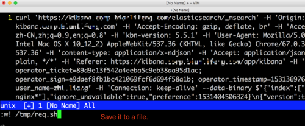

# kibana-pagination

Crawl ElasticSearch through Kibana web.

For log-data pagination, analysis, export.

```bash
npm install -g kibana-pagination
```

## 1. Copy

Chrome / Charles / Postman, network capture


## 2. Paste
Save it to a file



## 3. compile

```bash
kibana /tmp/req.sh
```


## 4. Save program

```bash
kibana /tmp/req.sh > _getLog.js
```


